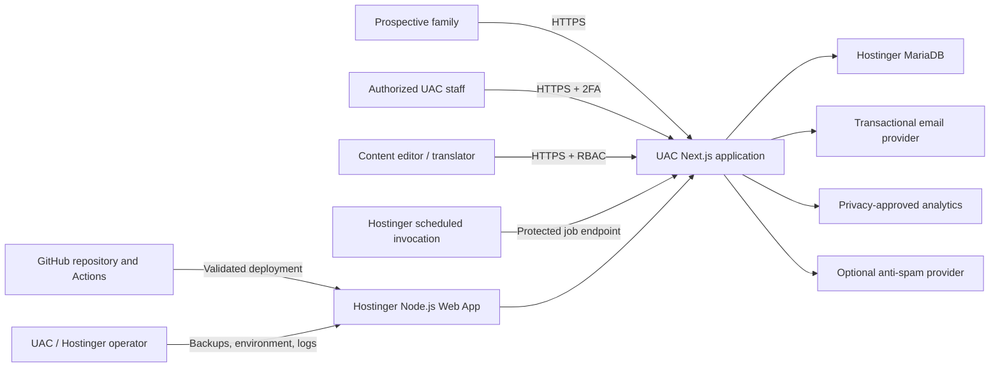
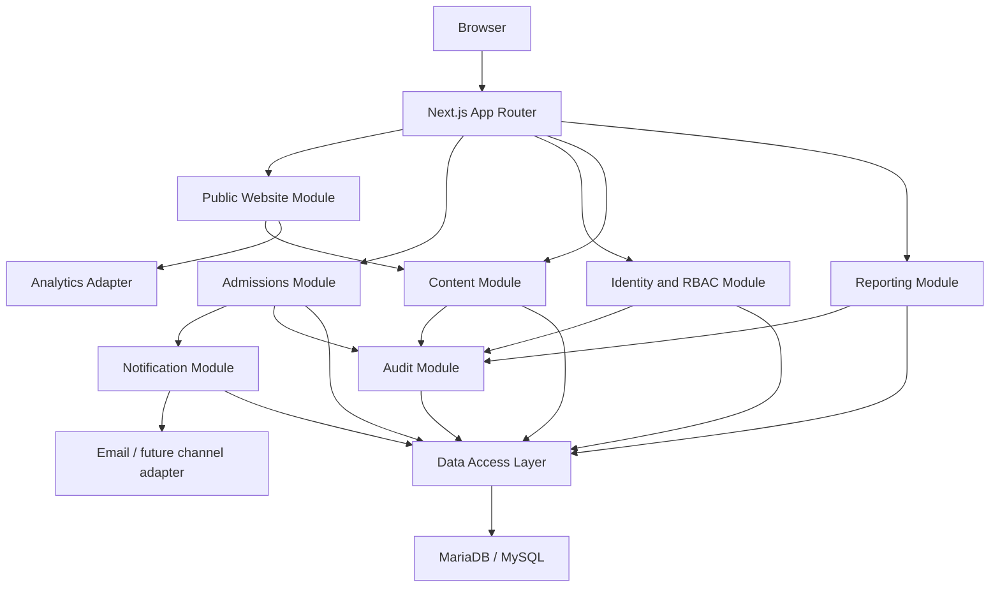
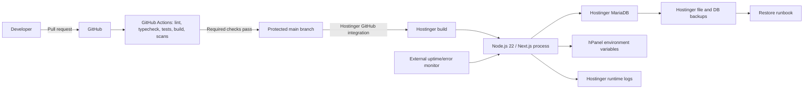
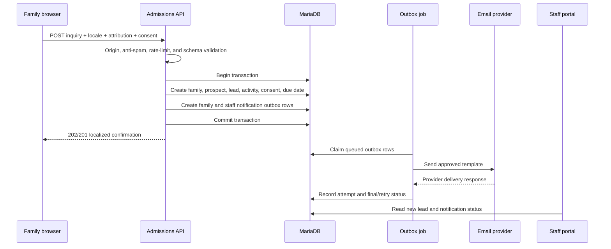
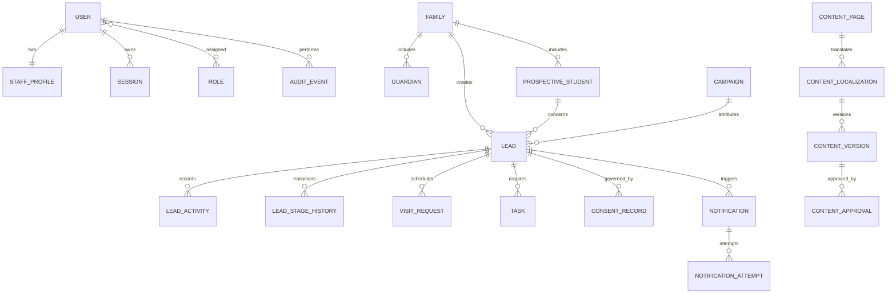

# UAC Ohio System Design Document

Document status: Proposed architecture  
Version: 0.1  
Date: 2026-07-18  
Repository: [ichillous/uacohio](https://github.com/ichillous/uacohio)

## Scope

This document defines the proposed Release 1 architecture for:

- the multilingual UAC public website;
- prospective-family inquiry and campus-visit capture;
- bounded content administration;
- invite-only staff authentication and role-based authorization;
- the enrollment pipeline, staff activities, dashboard, and exports;
- transactional notification orchestration, audit, monitoring, deployment, backup, and recovery.

It excludes official student enrollment processing, student information, attendance, transportation, academic records, general family messaging, and board packets until UAC identifies authoritative systems, policies, and integration owners.

### Architecture context

System type: traditional full-stack web application with sensitive family and minor-related data.  
Complexity: simple-to-growing, fewer than 1,000 expected daily users initially.  
Primary framework areas: security/privacy, reliability/operations, and maintainability/cost.  
Team assumption: one to three developers with limited dedicated operations capacity.  
Hosting assumption: Hostinger Business Web Hosting or Cloud with Node.js Web App support.

## Findings/Plan

### 1. Executive architecture decision

Build Release 1 as a modular full-stack monolith using Next.js 16, TypeScript, Hostinger-managed Node.js 22, and Hostinger MariaDB/MySQL. Use server-rendered public pages, route handlers/server actions for mutations, a custom bounded content module, Better Auth for invite-only staff identity and TOTP 2FA, Drizzle ORM for typed SQL and migrations, and a database outbox plus Hostinger scheduled invocation for notifications.

This is the smallest architecture that supports the public experience and protected staff workflow without introducing microservices, a queue cluster, Redis, containers, or a second database.

### 2. Architecture principles

1. One deployable system, explicit internal modules.
2. Server authorization is authoritative; the UI never grants access by itself.
3. Public reading remains available without client JavaScript where practical.
4. Family data is minimized, purpose-bound, and excluded from third-party analytics.
5. Official school data remains in designated systems of record.
6. Provider integrations sit behind adapters and can be replaced.
7. Accepted form submissions are durable before any notification is attempted.
8. Sample prototype data never enters production.
9. Build for current scale and add infrastructure only after measured thresholds.

### 3. System context diagram



### 4. Container and module design



#### Public Website Module

Responsibilities:

- locale routing and language switching;
- Home, Admissions, Academics, Student Life, About, and Contact composition;
- metadata, sitemap, canonical links, organization schema, and redirects;
- content rendering, caching, revalidation, and safe failure states;
- design system, responsive layouts, media rendering, and accessibility.

It reads only published content projections and never reads admissions records.

#### Admissions Module

Responsibilities:

- inquiry and visit contracts;
- validation, anti-spam, idempotency, attribution, and consent;
- family, guardian, prospective student, lead, stage, activity, task, visit, and duplicate-candidate behavior;
- staff queue, search, filters, ownership, stage transitions, due dates, and closed outcomes;
- transaction creation of lead/activity/outbox/audit records.

#### Identity and RBAC Module

Responsibilities:

- invite-only Better Auth integration;
- email verification, password reset, secure sessions, TOTP 2FA, and account lifecycle;
- staff profile, role, permission, and optional record scope;
- authorization helpers callable from every server read/mutation;
- security audit events.

#### Content Module

Responsibilities:

- predefined page schemas and localized fields;
- version, draft/review/approval/publish/archive states;
- locale/source-revision relationship and stale translation detection;
- preview and revalidation;
- repository-backed launch media references.

The MVP intentionally avoids a general visual page builder and broad browser file uploads.

#### Notification Module

Responsibilities:

- localized template versions;
- outbox enqueue within the business transaction;
- scheduled claiming, delivery, retry, failure, and monitoring;
- provider adapter for email and future SMS/WhatsApp;
- suppression of unnecessary child information.

#### Reporting Module

Responsibilities:

- metric definitions and permission-filtered queries;
- dashboard projections and data freshness;
- safe CSV and PDF exports;
- export audit and formula-injection prevention.

#### Audit Module

Responsibilities:

- append-oriented records for authentication, permissions, identifiable record views where approved, mutations, exports, publishing, and operations;
- safe before/after field names and selected non-secret metadata;
- correlation between request, actor, target, and outcome.

### 5. Deployment design



#### Environment mapping

| Environment  | Application                                     | Database                                        | Data                                | Purpose                      |
| ------------ | ----------------------------------------------- | ----------------------------------------------- | ----------------------------------- | ---------------------------- |
| Local        | Developer-run Next.js                           | Local MariaDB container or isolated local MySQL | Synthetic only                      | Development                  |
| CI / preview | Build and test process                          | Ephemeral MariaDB service                       | Synthetic only                      | Pull-request validation      |
| Staging      | Hostinger temporary domain or staging subdomain | Separate Hostinger database/user                | Synthetic or approved redacted data | UAT and deployment rehearsal |
| Production   | `uacohio.org` Hostinger Node.js Web App         | Production Hostinger database/user              | Approved production data            | Live service                 |

The staging and production applications must not share database credentials, authentication secrets, provider keys, analytics properties, or cookies.

#### Production cutover constraint

Hostinger documents that adding a Node.js website to a domain already configured as another website can require removing the existing website first. The deployment plan therefore requires a staging proof, downloadable backup, restoration test, approved cutover window, and account-owner authorization. No automation may remove the current website.

### 6. Runtime and request design

#### Public page request

1. Hostinger routes HTTPS to the Next.js process.
2. Middleware or route logic resolves the supported locale and safe redirect rules.
3. The public route reads the published content projection, preferably from the Next.js cache or a bounded database query.
4. The server renders semantic HTML and approved metadata.
5. Non-critical client behavior hydrates after the readable page is available.
6. Privacy-approved analytics records page and locale context without personal data.

#### Inquiry submission sequence



Durability rule: the browser receives success only after the lead and required outbox rows commit. External email delivery does not block the family transaction.

#### Staff lead mutation

1. Request carries a secure staff session cookie.
2. Authentication resolves the user and 2FA-complete session.
3. Authorization verifies permission and record scope on the server.
4. Validation parses the command and expected record version.
5. The admissions service applies stage/assignment/business rules in a database transaction.
6. The transaction records activity, stage history, audit, and any outbox event.
7. The response returns the updated safe projection and correlation ID.

Optimistic concurrency should use an `updated_at` or explicit version value so one staff member does not silently overwrite another's work.

### 7. Data design

#### Entity relationship overview



#### Key tables and constraints

| Table                   | Key fields and constraints                                                                                                   |
| ----------------------- | ---------------------------------------------------------------------------------------------------------------------------- |
| `families`              | ULID/UUID ID, created/updated UTC, archive state                                                                             |
| `guardians`             | Family FK, normalized email/phone where approved, contact preference, uniqueness strategy that allows shared family contacts |
| `prospective_students`  | Family FK, minimum approved name fields, grade interest; no birth date unless explicitly required                            |
| `leads`                 | Family/prospect FK, stage, owner, source/campaign, language, due date, version, created/updated UTC, closed outcome          |
| `lead_stage_history`    | Lead FK, from/to stage, actor, reason, immutable timestamp                                                                   |
| `lead_activities`       | Lead FK, type, safe note, outcome, actor, next action, timestamp                                                             |
| `visit_requests`        | Lead FK, requested day/time, confirmed time, status, owner                                                                   |
| `consent_records`       | Lead/family FK, purpose, notice version, choice, locale, timestamp, safe request context                                     |
| `notifications`         | Lead FK where applicable, template/version, locale, channel, recipient reference, state                                      |
| `notification_attempts` | Notification FK, attempt number, provider ID, safe result/error code, timestamps                                             |
| `outbox_jobs`           | Type, payload reference, state, attempts, available/locked times, idempotency key                                            |
| `audit_events`          | Actor, action, target type/ID, correlation ID, outcome, changed field names, timestamp                                       |
| `content_pages`         | Stable page key, workflow state, owner, review/expiry dates                                                                  |
| `content_localizations` | Page FK, locale, source revision, translation state                                                                          |
| `content_versions`      | Localization FK, version, structured content JSON, author, immutable created time                                            |

All tables use InnoDB, `utf8mb4`, explicit foreign keys, UTC timestamps, and reviewed indexes. Free-text notes and structured content have strict size limits.

#### Data minimization choices

- Public inquiry is treated as an expression of interest until UAC approves it as an official application.
- Do not collect date of birth, SSN, health, disability, immigration, disciplinary, or academic information in Release 1.
- Prefer child first name or approved minimum name fields rather than a full legal identity.
- Keep attribution, analytics, and authentication identifiers separate from family contact details.
- Use synthetic data in every non-production environment.

### 8. Authentication and authorization design

#### Authentication

- Better Auth uses the Hostinger MySQL connection and generated/migrated identity tables.
- Email/password is enabled with public signup disabled.
- Accounts are created through an authenticated administrator invitation flow.
- Email verification and password reset use the notification adapter.
- TOTP 2FA is mandatory before access to the portal; backup-code recovery is controlled and audited.
- Session cookies are Secure, HttpOnly, SameSite, scoped to the intended domain, rotated, and revoked after password reset, disablement, or security action.

#### Authorization model

| Role                | Primary permissions                                                                       |
| ------------------- | ----------------------------------------------------------------------------------------- |
| Super Administrator | User lifecycle, role assignment, configuration, full audit; used sparingly                |
| Admissions Manager  | All leads, assignment, transitions, reports, duplicate resolution, workflow configuration |
| Admissions Agent    | Assigned or approved-scope leads, activities, visit updates, allowed transitions          |
| Content Publisher   | Review, approve, publish, archive content                                                 |
| Content Editor      | Draft/edit/preview content, no publication                                                |
| Report Viewer       | Approved aggregate dashboards and exports, no lead mutation                               |

Permissions are fine-grained (`lead:read`, `lead:update`, `lead:assign`, `lead:transition`, `content:publish`, `report:export`, `user:admin`) and enforced within server services and database query scope.

### 9. Content architecture

The public design is component-based, while content editors need bounded control. Each public page therefore has an approved schema composed of known sections such as hero, trust strip, pillars, program cards, call-to-action, leadership profiles, contact details, and SEO fields.

Structured content is stored as validated JSON per version and locale. The renderer accepts only known component types and field schemas, preventing editors from injecting arbitrary scripts or layout code.

Publication flow:

1. Editor creates a source-locale draft.
2. Reviewer verifies school facts and claims.
3. Arabic and Somali drafts link to the approved source revision.
4. Publisher previews and publishes the version.
5. The application updates the published pointer and revalidates the affected locale route.
6. Audit records actor, revision, locale, approval, and publication time.

Launch media is committed to `public/` with the code so deployment is deterministic. A later ADR is required before allowing broad browser uploads; options include S3-compatible object storage, a managed media service, or a proven persistent Hostinger directory outside deployment output.

### 10. Notification and scheduled-job design

Release 1 requires transactional email for inquiry confirmation, staff alert, invite, verification, password reset, and optional overdue reminders.

The provider is selected through configuration and an interface such as:

```text
NotificationProvider.send(message) -> providerMessageId, acceptedAt
```

The database outbox avoids losing work when a provider is slow or unavailable. A Hostinger cron job calls a protected endpoint or supported command at least every five minutes. The worker claims a bounded batch using a lock/lease, sends each message, records the attempt, and applies bounded exponential retry. Permanent failures appear in the staff queue.

WhatsApp and SMS adapters remain feature-disabled until channel consent, templates, provider contract, retention, and human-review rules are approved.

### 11. Caching and performance design

- Public page content uses Next.js server caching/revalidation by page and locale.
- Publishing triggers targeted revalidation; a short maximum stale window is configured as a fallback.
- Staff pages are dynamic, authenticated, permission-filtered, and not stored in shared public caches.
- Database queries use explicit projections, pagination, and indexes rather than loading full entities.
- Connection pool starts at 10 and is adjusted only after confirming Hostinger limits and measured utilization.
- Images use responsive dimensions, modern formats, quality budgets, and lazy loading below the fold.
- Fonts are self-hosted or loaded with an approved privacy/performance strategy.
- No distributed cache is introduced until multiple app instances or measured database load requires it.

Scale triggers for reconsideration:

- sustained application CPU/RAM/I/O near Hostinger plan limits;
- more than 25 concurrent staff users or p95 portal query time above 500 ms after indexing;
- public traffic above 5,000 visits/day with cache misses causing server saturation;
- more than 1,000 queued notifications/day or five-minute processing target missed;
- requirement for multiple application instances with shared invalidation or job coordination.

### 12. Security design

#### Trust boundaries

1. Public internet to Hostinger/Next.js.
2. Authenticated staff browser to protected portal routes.
3. Application to MariaDB.
4. Application to email, analytics, anti-spam, and monitoring providers.
5. GitHub/CI to Hostinger deployment.
6. Hostinger operators to environment variables, database, logs, and backups.

#### Required controls

- TLS; HSTS after production validation; content security policy; frame, MIME, referrer, and permissions policies.
- Strict server validation, parameterized queries, escaped content rendering, and sanitized/limited notes.
- Origin/CSRF defense on session mutations; idempotency and rate limits on public mutations.
- Invite-only accounts, email verification, mandatory TOTP 2FA, secure sessions, least privilege, and access review.
- Secret separation by environment, no production secrets in GitHub or client bundles, and credential rotation procedure.
- Dependency, secret, static analysis, and Hostinger vulnerability review.
- Audit for identity, authorization, identifiable data actions, exports, content publication, and operations.
- Log redaction and no PII in third-party analytics.
- Threat model and privacy review before launch.

#### Principal threats and responses

| Threat                                 | Response                                                                                    |
| -------------------------------------- | ------------------------------------------------------------------------------------------- |
| Automated spam and form abuse          | Honeypot, rate limit, origin checks, optional challenge, monitoring, idempotency            |
| Account takeover                       | Verified invite, strong password, rate limit, TOTP 2FA, session rotation/revocation, alerts |
| Broken object authorization            | Server permission checks and scoped queries on every read/mutation/export                   |
| Stored XSS in content or notes         | Structured content schemas, escaped rendering, no arbitrary HTML/scripts, CSP               |
| SQL injection                          | Typed ORM, parameterized SQL, validation, reviewed raw SQL only                             |
| Data leakage to analytics/logs         | Allowlisted events, redaction, automated payload tests, no free text                        |
| Excessive export                       | Permission, filters, row limits, confirmation, audit, anomaly review                        |
| Lost submission during provider outage | Database transaction plus outbox; provider retry is asynchronous                            |
| Deployment or migration data loss      | Staging rehearsal, backup confirmation, reviewed migrations, rollback/restore runbook       |

### 13. Reliability and recovery design

- Liveness checks only process health; readiness checks database connectivity and critical configuration without revealing credentials or internal topology.
- Accepted submissions commit in one database transaction.
- Notifications use durable outbox state, idempotent claiming, retry, and visible failure.
- Scheduled work never relies on in-memory timers because Hostinger can restart the process.
- Hostinger daily backups are required for the target 24-hour RPO. If the plan provides weekly backups, configure daily backups or an approved external encrypted database export.
- Restore testing occurs in staging before launch and at least quarterly afterward.
- Application rollback returns to the previous known-good Git commit; database migrations prefer backward-compatible expand/migrate/contract steps.
- The target RTO is four hours, subject to Hostinger restore performance and operator access.

### 14. Observability design

#### Application diagnostics

- JSON logs with environment, request ID, route, duration, status, user ID where authorized, and safe entity IDs.
- Errors captured by a privacy-configured error monitor with request body, cookies, contact fields, notes, and secrets stripped.
- Metrics for request rate/error/duration, form outcomes, login failures, outbox depth/age, notification outcomes, database errors, export events, and content publication.

#### Operational dashboards

- Hostinger CPU, memory, I/O, deployment, vulnerability, and runtime-log views.
- External uptime checks for public home, liveness, and a synthetic no-data form health path where safe.
- Application dashboard for submission success, first-contact SLA, notification failure, and backlog.

Every alert includes an owner, severity, threshold, response window, and runbook.

### 15. CI/CD and migration design

Pull requests run deterministic install, lint, typecheck, unit/integration tests, MariaDB-backed tests, production build, E2E/accessibility smoke tests, dependency/secret/static scans, and placeholder/PII checks.

`main` is protected. Hostinger GitHub integration builds the approved commit with Node.js 22 and starts the Next.js server. Environment variables are configured in hPanel and validated at startup.

Schema definitions and generated SQL migrations are versioned. Sprint 0 must prove one of these Hostinger-safe migration paths:

1. a supported pre-start migration command using an advisory lock and idempotent migration table;
2. a protected one-off migration runner invoked by an authorized operator;
3. reviewed SQL applied through an approved hPanel/phpMyAdmin runbook.

Production deployment remains blocked until the selected path is tested, backed up, and documented. Automatic destructive migration is prohibited.

### 16. Alternatives considered

| Alternative                                  | Benefit                                         | Reason not selected for Release 1                                                                     | Reconsider when                                                                        |
| -------------------------------------------- | ----------------------------------------------- | ----------------------------------------------------------------------------------------------------- | -------------------------------------------------------------------------------------- |
| Static Astro/Next export plus external forms | Lowest server complexity and fast public pages  | Cannot deliver the integrated staff portal and content workflow without another backend               | Public site is approved as independent and portal moves to a managed SaaS              |
| WordPress with plugins                       | Hostinger-native CMS and editor familiarity     | Plugin/security surface, custom portal complexity, and weaker typed workflow/data boundaries          | Scope becomes brochure site plus simple third-party forms                              |
| Separate React frontend and Express API      | Clear client/server split                       | Two deployments, duplicated routing/auth/error concerns, more operations for a small team             | Independent clients or API consumers require it                                        |
| Microservices                                | Independent scaling and ownership               | Unnecessary coordination, deployment, observability, and consistency cost at current scale            | Distinct teams and measured scaling boundaries emerge                                  |
| Supabase for PostgreSQL/Auth                 | Managed auth and strong PostgreSQL capabilities | Adds an external data platform while Hostinger MariaDB already exists; vendor/privacy review required | Hostinger plan lacks suitable Node/MySQL support or managed auth reduces approved risk |
| Hostinger VPS                                | Full runtime and database control               | Higher patching, security, monitoring, backup, and on-call burden                                     | Managed Web/Cloud constraints block requirements or scale demands dedicated resources  |
| General headless CMS                         | Mature editorial tooling                        | Another vendor, integration, permissions, localization, and cost surface                              | Editorial volume or media workflow exceeds bounded custom content schemas              |

### 17. Architecture decision and ADR triggers

The following decisions are recorded in `docs/architecture/`:

- ADR-001 modular full-stack monolith;
- ADR-002 Hostinger Node.js deployment;
- ADR-003 Hostinger MariaDB;
- ADR-004 invite-only staff authentication and RBAC;
- ADR-005 repository-first media and bounded content management;
- ADR-006 notification provider adapter and transactional outbox.

Create or revise an ADR when:

- the Hostinger plan cannot support the selected runtime or safe migration flow;
- production needs multiple application instances, a queue, Redis, object storage, or a second database;
- UAC adopts an external SIS, CRM, identity provider, CMS, messaging, or analytics platform;
- compliance review changes data location, vendor, retention, authentication, logging, or consent requirements;
- expected cost materially exceeds the approved budget;
- a technology choice requires meaningful team training or on-call responsibility.

## Risks

| ID   | Risk                                                                           | Severity | Mitigation / owner decision                                                           |
| ---- | ------------------------------------------------------------------------------ | -------- | ------------------------------------------------------------------------------------- |
| R-01 | Hostinger plan is below Business or Cloud and cannot run Node.js               | High     | Confirm in Discovery; upgrade or choose approved alternate architecture               |
| R-02 | Replacing the current Hostinger website causes downtime or data loss           | High     | Stage first, download/verify backups, require explicit account-owner cutover approval |
| R-03 | Database migration execution is not safely supported in the managed deployment | High     | Complete Sprint 0 spike and select a documented operator-controlled path              |
| R-04 | Existing SIS/attendance systems are unknown                                    | High     | Keep those modules outside Release 1 and perform source-system discovery              |
| R-05 | Family/minor data creates legal, privacy, and vendor obligations               | High     | Minimize fields, complete counsel/privacy review, approve retention and vendors       |
| R-06 | Custom content workflow expands into a full CMS                                | Medium   | Fixed page schemas and text/media-reference editing only in MVP                       |
| R-07 | Hostinger/local email limits or deliverability miss notifications              | Medium   | Provider adapter, dedicated transactional service decision, delivery status and retry |
| R-08 | Arabic RTL or translation quality fails critical journeys                      | High     | Qualified review and language-specific accessibility/UAT gate                         |
| R-09 | One-business-day lead response cannot be operationally staffed                 | Medium   | Define queue owner, calendar, alerts, escalation, and fallback contact process        |
| R-10 | Small team accumulates too many technologies                                   | Medium   | Preserve monolith and defer nonessential providers/infrastructure                     |
| R-11 | Hostinger resource limits constrain campaign bursts                            | Medium   | Cache public pages, load-test, monitor hPanel resources, set upgrade trigger          |
| R-12 | Prototype claims or sample data reach production                               | High     | Verified content register, synthetic data, automated placeholder scan, launch gate    |

## Action Items

1. Confirm Hostinger plan, Node.js support, staging capacity, database limits, backup frequency, and account owner.
2. Inventory the current `uacohio.org` website, DNS, SSL, email, files, databases, analytics, and backups without changing production.
3. Name the product owner, admissions owner, data owner, privacy/security reviewer, content approvers, translators, and support owner.
4. Approve Release 1 boundaries and the modular-monolith, Next.js, MariaDB, Better Auth, Drizzle, and outbox ADRs.
5. In Sprint 0, prove Hostinger GitHub deployment, environment variables, runtime logs, restart, health endpoints, database pooling, migration, scheduled invocation, backup, and restore.
6. Approve the exact inquiry/visit fields, consent notice, retention, first-response service level, and transactional email provider.
7. Create the repository scaffold only after the deployment and data spikes pass.
8. Run threat modeling and data-flow review before public form implementation.

## Handoff to Next Agent

The next implementation task should scaffold only the engineering foundation and deployment spike, not the complete website. Required inputs are:

- confirmed Hostinger plan and staging approach;
- approved ADRs;
- selected package versions at the time of scaffold;
- approved environment-variable names and secret ownership;
- decision on the Hostinger-safe migration path;
- named reviewers for architecture, security/privacy, accessibility, and content.

Expected first implementation deliverable:

```text
Next.js/TypeScript repository scaffold
+ modular folder boundaries
+ local and CI MariaDB setup
+ environment validation
+ liveness/readiness endpoints
+ CI checks
+ Hostinger staging deployment proof
+ one reversible database migration
+ baseline security headers
+ test and runbook skeletons
```

Do not add real family, student, staff, production database, or provider credentials during scaffold work.

### Source references

- [Hostinger: Deploy a Node.js Web App](https://www.hostinger.com/support/how-to-deploy-a-nodejs-website-in-hostinger/)
- [Hostinger: Connect MySQL to a Node.js application](https://www.hostinger.com/support/connecting-a-hostinger-mysql-database-to-a-node-js-application/)
- [Hostinger: Hosting plan parameters and limits](https://www.hostinger.com/support/6976044-parameters-and-limits-of-hosting-plans-in-hostinger/)
- [Hostinger: Download backups](https://www.hostinger.com/support/5981435-how-to-download-backups-at-hostinger/)
- [Next.js: Installation and requirements](https://nextjs.org/docs/app/getting-started/installation)
- [Next.js: Deployment modes](https://nextjs.org/docs/app/getting-started/deploying)
- [Better Auth: Email and password](https://better-auth.com/docs/authentication/email-password)
- [Better Auth: MySQL adapter](https://better-auth.com/docs/adapters/mysql)
- [Better Auth: Two-factor authentication](https://better-auth.com/docs/plugins/2fa)
- [Drizzle ORM: MySQL](https://orm.drizzle.team/docs/mysql/get-started-mysql)
- [Drizzle ORM: Migrations](https://orm.drizzle.team/docs/migrations)
